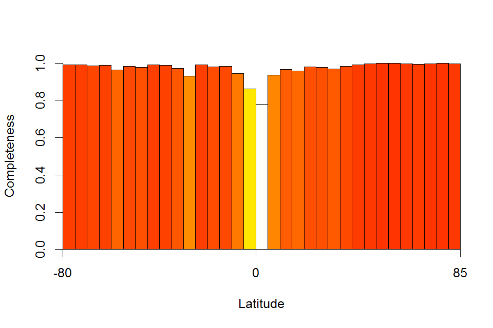

Marine Spatial Gaps
================
André Menegotto

<br> In this document I provide the R code to calculate the species
richness and the number of missing species for 5-degrees latitudinal
bands. I also provide the code to calculate the sampling effort and
three methods of inventory completeness. The code provided here was
developed for the paper `Mapping knowledge gaps in marine diversity
reveals a latitudinal gradient of missing species richness`. Please,
check the [paper](https://doi.org/10.1038/s41467-018-07217-7) if you
need more information. All functions developed in this code are
presented in the end of the page.

<br> First, you need load the dataset to run the analyses. Here, I
provide a compiled dataset with Ophiuroidea records to illustrate the
functions.

``` r
load("Example.RData")
```

<br> Now you can calculate the species richness and the number of
missing species. Note that dark grey bars represent number of observed
species and light grey bars represent number of missing
species.

``` r
resu <- GapRichness(matriz = Ophiuroidea)
```


The output is a list with the number of observed and missing species by
latitudinal band and in the whole dataset.

``` r
# Species richness by latitude
resu$Richness
```

    ## -80 -75 -70 -65 -60 -55 -50 -45 -40 -35 -30 -25 -20 -15 -10  -5   0   5 
    ##  51  66 102  90  80 128 133 180 278 328 341 536 397 368 396 345 254 439 
    ##  10  15  20  25  30  35  40  45  50  55  60  65  70  75  80 
    ## 458 377 518 383 342 236 165 148 133 101  69  57  41  18  17

``` r
# Missing species by latitude
resu$Gaps
```

    ## -80 -75 -70 -65 -60 -55 -50 -45 -40 -35 -30 -25 -20 -15 -10  -5   0   5 
    ##   0   5   7  22  31  23  41  46  44  72 137 113 208 238 238 308 370 251 
    ##  10  15  20  25  30  35  40  45  50  55  60  65  70  75  80 
    ## 229 280 166 144  64  49  53  46  38  21  13   5   4   2   0

``` r
# Total number of observed species
resu$nSP
```

    ## [1] 1793

``` r
# Total number of species with spatial gaps
resu$nSP_gap
```

    ## [1] 814

<br> Calculate the spatial distribution of number of sampling events.
Here, each sampling events is a unique combination of latitude,
longitude and date of
collection.

``` r
UnicSamp(matriz = Ophiuroidea, plot = T)
```


    ##  [1]   195   303   597   427   123   790   842  1848  2829  1679   790
    ## [12]  3737  2042  1763   793   432   286  1028  1574  1209  1818  2124
    ## [23]  1676  2489  3681  4357 11761 12564  2186  1376   993   856   229

<br> Now calculate the inventory completeness. Below there are three
different methods to estimate the completeness of each latitudunal band.
Only the first two were used in the paper cited above. You can check the
original publication for more details.

``` r
# Sample coverage
c1 <- SampCovComplet(matriz = Ophiuroidea)
plot.bar(c1)
```



``` r
# Species accumulation curve (this process may be time-consuming)
c2 <- SACcomplet(matriz = Ophiuroidea)
plot.bar(c2)
```


``` r
# Sousa-Baena's
c3 <- SBcomplet(matriz = Ophiuroidea)
plot.bar(c3)
```


<br>

# Functions

See below the code of the functions used above. All functions have only
one argument ‘*matriz*’, which requires a data matrix as input. The
matrix must have at least four columns in the following order: species
name, longitude, latitude, and sampling date.

<br> **Function to calculate latitudinal distribution of species
richness and spatial gaps**

``` r
GapRichness <- function(matriz)
{
  # Determine unique species names in the dataset
  species <- as.character(unique(matriz[,1]))
  nSP <- length(species)
  
  # Output matrices
  matOcc <- matrix(data = NA, nrow = length(species), ncol = 33)
  colnames(matOcc) <- seq(-80, 80, 5)
  
  matGap <- matrix(data = 0, nrow = length(species), ncol = 33)
  colnames(matGap) <- colnames(matOcc)
  
  # For each species
  nSP_gap <- 0
  for(i in 1:length(species))
  {
    # Find all occurrences
    pos <- which(matriz[,1]==species[i])
    occ <- matriz[pos,3]
    z <- hist(occ, breaks = seq(-80, 85, 5), plot = F)
    
    matOcc[i,] <- ifelse(z$counts>0, 1, 0)
    
    # Find gaps within its range
    ocup <- which(matOcc[i,]==1)
    gap <- which(matOcc[i,min(ocup):max(ocup)] == 0)
    
    # If there is gaps
    if(length(gap)>0)
    {
      # Save this information
      nSP_gap <- nSP_gap + 1
      
      for(j in 1:length(gap))
      {
        # And inform the latitude where is the gap for this species
        w <- which(colnames(matOcc)==names(gap[j]))
        matGap[i,w] <- 1
      }
    }
  }
  
  # Plot richness and gaps distribution
  sumRichness <- colSums(matOcc)
  sumGaps <- colSums(matGap)
  
  barplot(sumRichness, space=0, col=rgb(0.1,0.1,0.1,0.5), ylab="N. of species", xlab="Latitude", xaxt="n")
  barplot(sumGaps, space=0, col=rgb(0.8,0.8,0.8,0.5), xaxt="n", add=T)
  axis(side=1, at=c(0,16,33), labels=c(-80,0,85))

  # Return output
  resu <- list(Richness=sumRichness, nSP=nSP,
               Gaps=sumGaps, nSP_gap=nSP_gap)
  
  return(resu)
}
```

<br> **Function to calculate latitudinal distribution of unique sampling
events**

``` r
UnicSamp <- function(matriz, plot=F)
{
  # Determine unique sampling events (lat,long,date)
  unic <- unique(matriz[,c(2,3,4)])
  
  # Extract the latitude of each sampling events
  lat <- unic[,2]
  
  # Plot the distribution
  if(plot==F)
  {
    x <- hist(lat, breaks = seq(-80, 85, 5), plot=F)
  }
  else
  {
    x <- hist(lat, breaks = seq(-80, 85, 5), xaxt="n", col = rgb(0.1,0.1,0.1,0.5), xlab = "Latitude", ylab = "N. of sampling events", main=NULL)
    axis(side=1, at=c(-80,0,85))
  }
  
  # Return the output
  return(x$counts)
}
```

<br> **Function to estimate inventory completeness based on sample
coverage**

Note that you can also use the R package ‘iNEXT’ to calculate sample
coverage.

``` r
SampCovComplet <- function(matriz)
{
  # Determine species unique records
  unic <- unique(matriz[,c(1,2,3,4)])
  
  # Create latitudinal intervals (5? bands)
  unic[,5] <- cut(unic[,3], breaks = seq(-80, 85, 5))
  lev <- levels(unic[,5])
  
  # Calculate level of completeness
  k <- numeric()
  
  # For each latitudinal band:
  for(i in 1:length(lev))
  {
    # Find all records
    rec <- which(unic[,5]==lev[i])
    
    if(length(rec)==0)
    {
      k[i] <- NA
    }
    else
    {
      # n = number of specimens (number of records)
      n <- length(rec)
      # f1 = number of singletons
      f1 <- sum(table(unic[rec,1])==1)
      # f2 = number of doubletons
      f2 <- sum(table(unic[rec,1])==2)
      
      # Completeness estimate
      num <- (n-1)*f1
      den <- ((n-1)*f1)+(2*f2)
      
      if(den==0)
      {
        k[i] <- NA
      }
      else
      {
        k[i] <- 1 - ((f1/n)*(num/den))
      }
    }
  }
  return(k)
}
```

<br> **Function to estimate inventory completeness based on species
accumulation curve**

Note that here I calculate the species accumulation curve by sampling
event. You can also calculate the accumulation of species by records. In
this case, the result become very similar to that of sample coverage. In
addition, you can also check the paper of Stropp et al. (Global Ecology
and Biogeography, 25(9): 1085-1096) for an alternative and simpler
method of completeness estimation.

``` r
SACcomplet <- function(matriz)
{
  require('reshape')
  require('vegan')
  
  # Determine species unique records
  unic <- unique(matriz[,c(1,2,3,4)])
  
  # Create latitudinal intervals (5? bands)
  unic[,5] <- cut(unic[,3], breaks = seq(-80, 85, 5))
  lev <- levels(unic[,5])
  
  # Progress bar (this process may be time-consuming)
  pb <- txtProgressBar(min = 0, max = length(lev), style = 3)
  
  # Calculate level of completeness
  r <- numeric()
  
  # For each latitudinal band:
  for(i in 1:length(lev))
  {
    # Find all records
    rec <- which(unic[,5]==lev[i])
    
    if(length(rec)==0)
    {
      r[i] <- NA
    }
    else
    {
      # Create a submatrix with data of this latitudinal band
      tempMat <- unic[rec,]
      tempMat2 <- cbind(tempMat[,1:4], count=rep(1, nrow(tempMat)))
      
      # Transform the submatrix in a community matrix
      CommMat <- cast(tempMat2, decimalLatitude + decimalLongitude + eventDate ~ species, value = "count")
      CommMat2 <- as.data.frame(CommMat)
      CommMat3 <- CommMat2[,-c(1,2,3)]
      CommMat3 <- as.matrix(CommMat3)
      CommMat3[which(is.na(CommMat3))] <- 0
      
      # Completeness was not calculated when there was less than 40 sampling events in the latitude because it will imply in only three points in the regression (since we use the last 10% of SACs)
      if(nrow(CommMat3) < 40)
      {
        r[i] <- NA
      }
      else
      {
        # Calculate species accumulation
        sp1 <- specaccum(CommMat3)
        
        # Extract the last 10%
        x <- quantile(sp1$richness, probs = c(0.9))
        Lten <- which(sp1$richness >= x)
        vec <- sp1$richness[Lten]
        
        # Result (1 - regression slope)
        slope <- 1-lm(vec~seq(1,length(vec),1))[[1]][[2]]
        
        if(is.na(slope))
        {
          r[i] <- NA
        }
        else
        {
          if(slope >= 0)
          {
            r[i] <- slope
          }
          else
          {
            # A rapid increase of new species may create negative completeness (slope higher than 1) and we considered as zero
            r[i] <- 0
          }
        }
      }
    }
    setTxtProgressBar(pb, i)
  }  
  return(r)
}
```

<br> **Function to estimate inventory completeness based on
Sousa-Baena’s method**

``` r
SBcomplet <- function(matriz)
{
  # Determine species unique records
  unic <- unique(matriz[,c(1,2,3,4)])
  
  # Create latitudinal intervals (5? bands)
  unic[,5] <- cut(unic[,3], breaks = seq(-80, 85, 5))
  lev <- levels(unic[,5])
  
  # Calculate level of completeness
  C <- numeric()
  
  # For each latitudinal band:
  for(i in 1:length(lev))
  {
    # Find all records
    rec <- which(unic[,5]==lev[i])
    
    if(length(rec)==0)
    {
      C[i] <- NA
    }
    else
    {
      # Number of observed species
      sp <- unique(unic[rec,1])
      Sobs <- length(sp)
      # Number of observed species only once
      a <- sum(table(unic[rec,1])==1)
      # Number of observed twice
      b <- sum(table(unic[rec,1])==2)
    
      if(b==0)
      {
        C[i] <- NA
      }
      else
      {
        C[i] <- Sobs/(Sobs+((a^2)/(2*b)))
      }
    }
  }
  return(C)
}
```

<br> **Function to plot the inventory completeness estimate**

``` r
plot.bar <- function(vetor, labName="Completeness")
{
  # This option differentiates zero from NA.
  if(any(vetor > 0, na.rm = T))
  {
    zero <- which(vetor == 0)
    vetor[zero] <- 0.01
  }
  
  barplot(vetor, ylim=c(0,1), xlab="Latitude", ylab=labName, xaxs="i", space = 0,
          col=rev(heat.colors(100))[cut(vetor,85)])
  axis(side=1, at=c(0,16,33), labels=c(-80,0,85))
}
```
